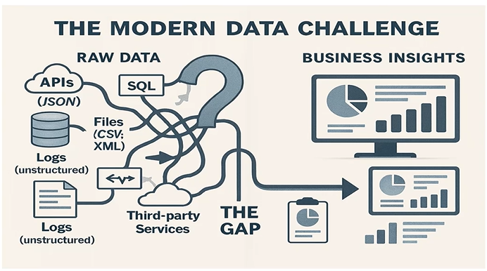
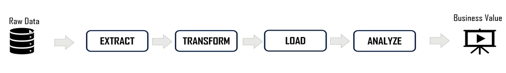
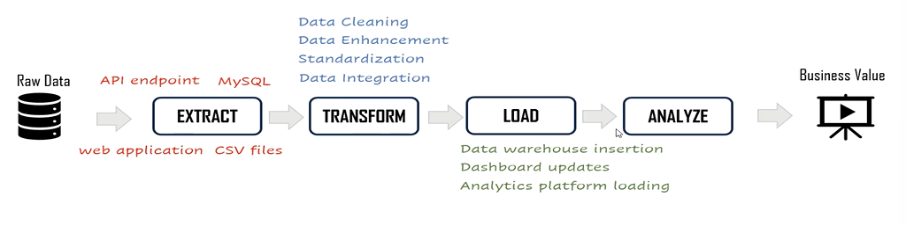
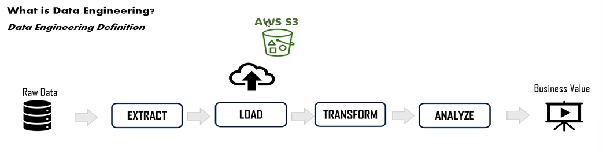
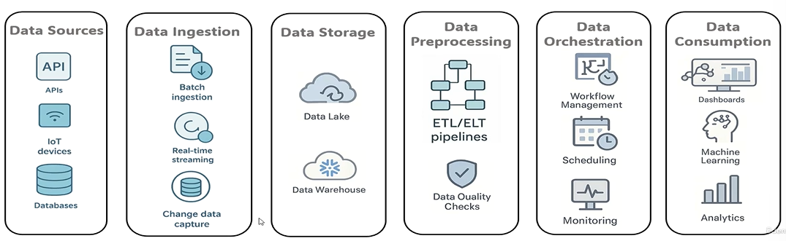

# Introduction to Data Engineering

- Data engineering is different than data science or data analysis

- what is the data problem ?
    - companies are drowning in data  ---> the data is coming from a lot of sources and in differnt formats
    - data formats like
        - structured data  ---> database records
        - semi structured  ---> JSON from API
        - unstructured     ---> Text files and PDFs
    - how to turn the messy scattered data into something that can drive business decisions ?
    

- What is the definition of Data Engineering ?
    - Data engineers are the architects and builders who create the system that makes analysis of the data possible
    
    - Create reliable automated system that collect clean transform and deliver that data to where it needs to go
    - build the highways that data travels on

- ## ETL and ELT
    - ETL  ---> extract; transform; load
        - extract the data that we need and flow it in the pipeline
        - transforming it  ---> preprocessing, like cleaning, standardizing the data, data integration etc ...
        - load the data ---> insert the data into datawarehouse or sed it to updated dashboards ---> usually its going to a data warehouse
        
        - slow expensive and difficult to change
        - single purpose method ---> data is transformed to one specific usecase

    - ELT  ---> extract; load; transform ---> Used in this course
        - more flexible and more cost effective
        - handle and batch real time data
        - serve multiple usecases from the same data platform
        - extract the data from the sources ---> load the data into cloud, datalake (amazon S3 or azure datalake) ---> transformation happens when and how is needed (using data compute)
        - multi purpose ---> transformation is done when needed based on the use case ---> it will tap into the datalake
        

- ## Data Engineering Ecosystem
    - 
    - Data Soruces
        - Databases
        - APIs
        - IOT devices ---> like sensors and SCADA Devices
        - CSV files
        - Realtime click stream data
        - etc...
    - Data Ingestion
        - how to reliably move data from sources to the my data platform
        - example:
            - Batch ingestion
            - Real-time streaming ---> apache Kafka to stream every website click as it happens
            - CDC ---> change data capture ---> automatically detecting any changes in the database table
    - Data Storage
        - modern storage designed for flexibility and scale
        - examples:
            - Datalakes: (Amazon S3 or Azure datalake) ---> store data in its original fomat (csv files or pdfs etc...)
            - Data Warehouse (snowflake or redshift) optimized for fast analytical queries
    - Data Preprocessing
        - 

    

