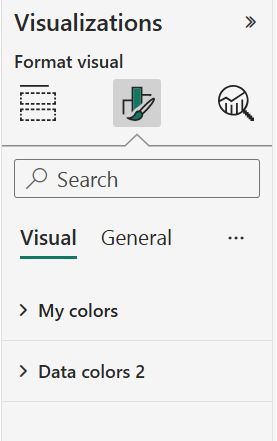

# Environment Setup

---

Install the following:

1. Node.js
2. VScode

```bash
npm i msi-packager -g
```

```bash
npm i powerbi-visuals-tools -g
```

```bash
pbiviz --install-cert
```
to preview and debug the visual we need this certificate so the powerbi service server in the browser can communicate with my machine

```bash
npm i d3 -g
```
to add shapes in my custom visual I need a D3.js ---> D3.js is javascript

```bash
npm i @types/d3 -g
```
This library helps d3.js and type script talk with each other

```bash
npm i core-js -g
```
This will hlep older browsers work out with what is going on with newer code

```bash
npm i powerbi-visuals-api -g
```
This is the powerbi API ---> what lets me write the custom visuals

```bash
pbivis new Myvisual
pbivis start
```

Create a .gitignore file that contains the following ---> we do not need to package all the modules in the final .pbiviz file
```text
node_modules
.DS_Store
.tmp
dist
typings
.api
*.log
```


---


## Understanding the Folder structure


---


node_modules  ---> this folder contains all the modules that I will be using to create the visual ---> Dependencies


- Settings.ts
This typescript file contains the settings data that the user can interact with, like setting the color etc...



a category is a text field that is used to group data together

a measure is a numeric field that is displayed


