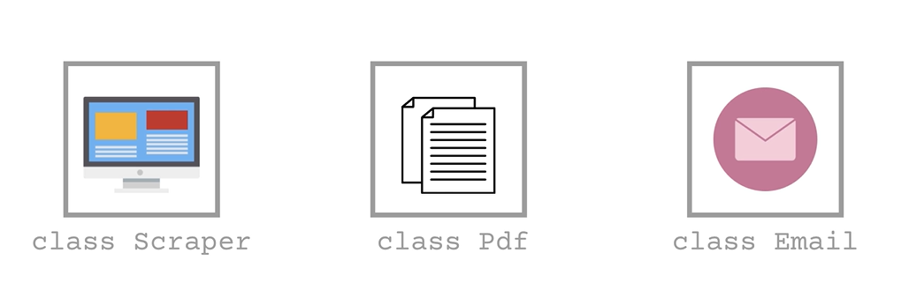

# Introduction

---

Everything in python is an object ---> Classes

- write calsses
- assign methods to these classes

The three Paradigms of programming
1. fucntional programming
    - spaguetti code
2. Procedural programming
    - spaguetti code
3. Objects oriented programming ---> when we use programming
    - it is the best
    - the elements of the program or decouples and independent of eachother
    - 
    - Easier to prgram ---> working part by part
    - Easier to maintain the program
    - Easier to extend and reuse parts of the program

We will build 10 professional programs ---> I will learn the following skills
    - PDF Generator
    - Web Apps
    - Desktop GUI Programs
    - Web Scraping
    - Mobile apps
    - News Reports
    - Sending Emails

IDE ---> Integrated Development Environment
    - text editor with extra features for programming
    - Pycharm and VScode

